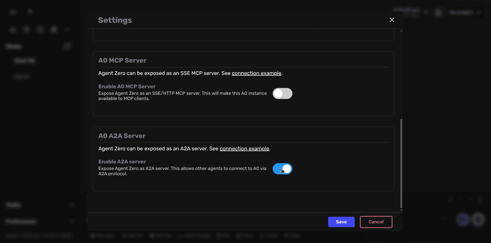
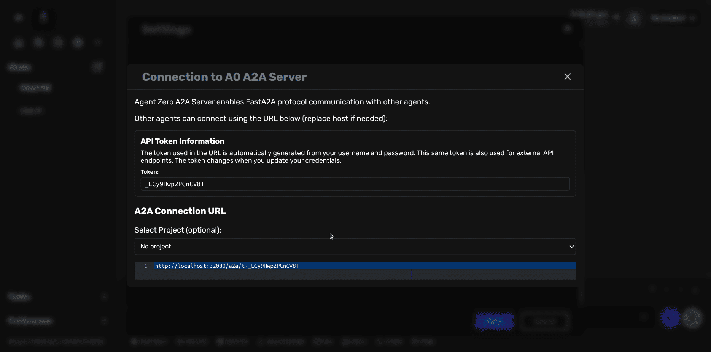

# A2A Server Setup

Agent Zero can communicate with other Agent Zero instances using the A2A (Agent-to-Agent) protocol based on FastA2A. This guide shows you how to enable and configure A2A connectivity through the Settings UI.

## What is A2A?

A2A enables direct communication between multiple Agent Zero instances. This allows:

- **Distributed workflows** - Delegate tasks to specialized agent instances
- **Context isolation** - Maintain separate workspaces for different agents
- **Long-running collaboration** - Persistent agent-to-agent conversations
- **Project-specific delegation** - Route work to agents with specific project contexts

> [!NOTE]
> This guide covers enabling Agent Zero as an A2A server. For API-level integration details, see the [advanced connectivity documentation](../developer/connectivity.md).

## Enabling the A2A Server

### Step 1: Open A2A Configuration

1. Click **Settings** in the sidebar
2. Navigate to the **MCP/A2A** tab
3. Scroll to the **A0 A2A Server** section
4. Toggle **Enable A2A server** to ON



### Step 2: Get Connection URL

1. Click on **connection example** to view your A2A connection details
2. The dialog displays:
   - **API Token** - Automatically generated from your username and password
   - **A2A Connection URL** - The full URL other agents will use to connect
   - Optional **Project selector** - To create project-specific connection URLs



### Step 3: Save Configuration

1. Click **Save** to apply your settings
2. The A2A server is now active and ready to accept connections

> [!IMPORTANT]
> The API token changes when you update your Agent Zero credentials. Existing connections will need to be reconfigured with the new token.

## Connection URL Format

The basic A2A connection URL follows this format:

```
http://YOUR_HOST:PORT/a2a/t-YOUR_API_TOKEN
```

### With Project Context

To connect with a specific project active:

```
http://YOUR_HOST:PORT/a2a/t-YOUR_API_TOKEN/p-PROJECT_NAME
```

When a project is specified:
- All A2A conversations run in that project's context
- The agent has access to project-specific resources and knowledge
- Enables isolated, project-focused agent collaboration

## Example Use Cases

### 1. Local Development Setup

Two Agent Zero instances on the same machine:

```
Instance 1: http://localhost:8080/a2a/t-abc123xyz
Instance 2: http://localhost:8081/a2a/t-def456uvw
```

### 2. Remote Agent Collaboration

Connect to a remote Agent Zero instance:

```
http://agent.example.com:8080/a2a/t-remote-token
```

### 3. Project-Specific Delegation

Main agent delegates frontend work to specialized agent:

```
http://localhost:8081/a2a/t-frontend-token/p-webapp-ui
```

## Docker Networking

If running Agent Zero in Docker:

- **Same Host:** Use `host.docker.internal:PORT` (macOS/Windows) or container networking (Linux)
- **Different Hosts:** Use the public IP or domain name of the target instance
- **Port Mapping:** Ensure the Agent Zero port is exposed in your Docker configuration

## Security Considerations

- **Token Protection:** Keep your API tokens secure - they provide full access to your Agent Zero instance
- **Network Access:** Consider using firewalls or reverse proxies to restrict A2A endpoint access
- **HTTPS:** For production deployments, use HTTPS to encrypt A2A communication
- **Credential Rotation:** Changing your password will invalidate all existing A2A connection URLs

## Testing Your Connection

You can test A2A connectivity using curl:

```bash
curl -X POST http://localhost:8080/a2a/t-YOUR_TOKEN \
  -H "Content-Type: application/json" \
  -d '{"message": "Hello from another agent"}'
```

## A2A vs MCP

| Feature | A2A | MCP |
|---------|-----|-----|
| **Purpose** | Agent-to-agent chat delegation | Tool/function access |
| **Use Case** | Long-running conversations | Specific tool calls |
| **Context** | Full chat context | Function parameters only |
| **Best For** | Workflow delegation | Tool integration |

> [!TIP]
> Use A2A when you need another agent's reasoning and conversation capabilities. Use MCP when you just need access to specific tools or functions.

## Troubleshooting

### Connection Refused

- Verify the A2A server is enabled in Settings
- Check that the Agent Zero instance is running
- Confirm the port is accessible (check firewall rules)

### Invalid Token

- Token may have changed due to credential updates
- Generate a new connection URL from Settings > MCP/A2A
- Update the connecting agent's configuration

### Project Not Found

- Verify the project name in the URL matches exactly
- Check that the project exists in the target instance
- Project names are case-sensitive

## Advanced Configuration

For detailed A2A protocol specifications, API examples, and integration patterns, see the [Advanced Connectivity Guide](../developer/connectivity.md).
