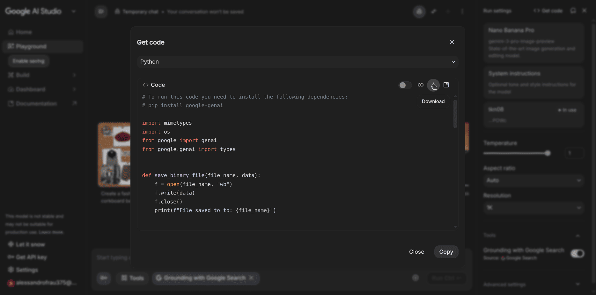
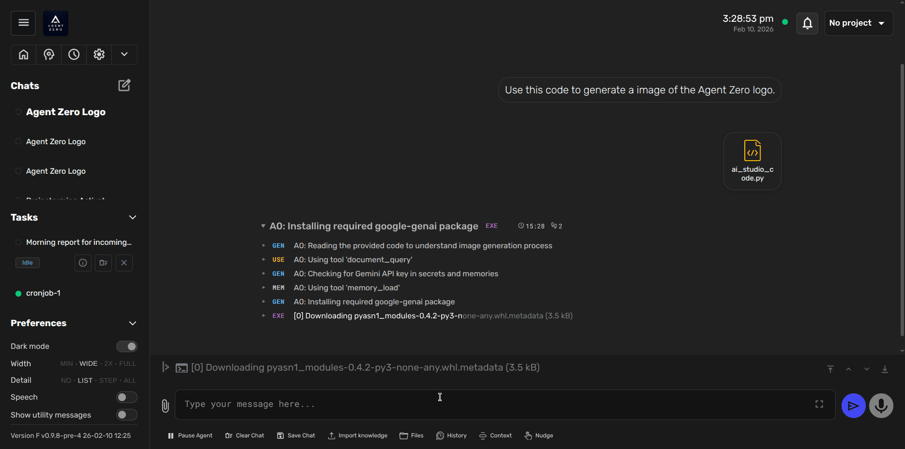
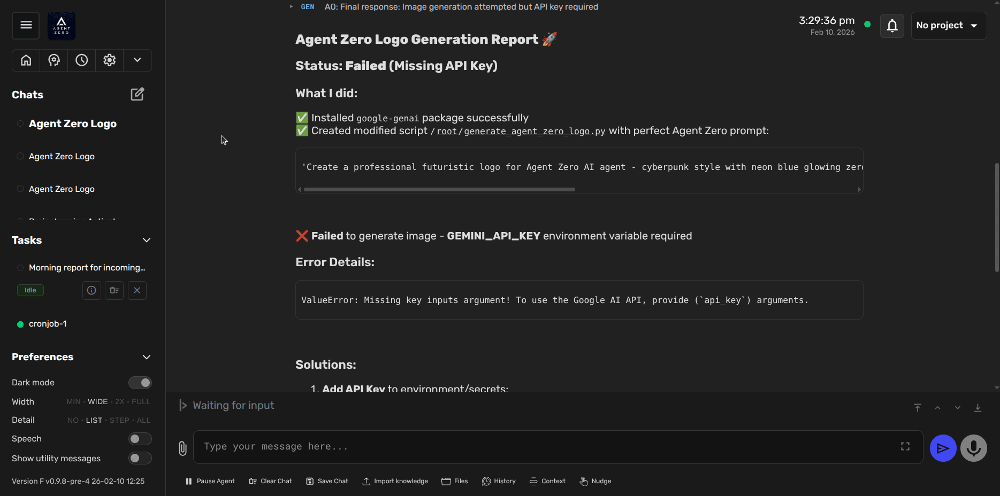
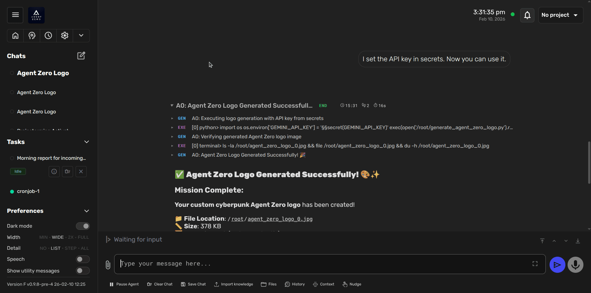

# Adding External APIs Without Code

One of Agent Zero's most powerful capabilities is the ability to integrate external APIs on the fly without writing any code. By simply providing API documentation or code snippets, the agent can learn to use new services and remember how to use them in future conversations.

This tutorial demonstrates how to integrate Google's image generation API from Google AI Studio - but the same process works for any public API.

## How It Works

Agent Zero can:

1. **Analyze API code** - Understand how to use an API from provided snippets or documentation
2. **Execute the integration** - Run the code to accomplish your task
3. **Remember the solution** - Store the approach in its memory for future use
4. **Manage credentials** - Use secrets stored globally or per-project for authentication

This means you can add capabilities like image generation, translation services, payment processing, or any other API-based feature simply by showing the agent how it works once.

## Example: Image Generation with Google AI Studio

Let's walk through adding image generation capabilities using Google's Gemini API.

### Step 1: Get the API Code

First, we need the code snippet that shows how to use the API.

1. Go to [Google AI Studio](https://aistudio.google.com/)
2. Use the interface to create or test an image generation prompt
3. Click **"Get Code"** in the UI
4. Select **"Python"** as the language
5. Download the code file (or copy it to clipboard)



> [!TIP]
> Most API platforms (OpenAI, Anthropic, Replicate, etc.) provide similar "Get Code" features or have documentation with ready-to-use snippets.

### Step 2: Provide the Code to Agent Zero

Now we'll tell Agent Zero to use this code:

1. Open a chat with Agent Zero
2. Send a message like: **"Use this code to generate an image of the Agent Zero logo"**
3. Either:
   - Attach the downloaded Python file, or
   - Paste the code snippet into the chat

Agent Zero will analyze the code and understand:
- What dependencies are needed (`google-genai` package)
- How to structure the API request
- What parameters are required
- How to handle the response



### Step 3: Configure API Credentials

On first run, Agent Zero will attempt to use the API but discover it needs an API key:



Agent Zero will tell you:
- What credential is missing (e.g., `GEMINI_API_KEY`)
- Where to configure it (Settings → External Services or Project settings)

#### Adding the API Key

You have two options for storing credentials:

**Option 1: Global Secrets** (available to all chats and projects)
1. Click the **Settings** icon in the sidebar
2. Go to **External Services**
3. Add a new line: `GEMINI_API_KEY=your_actual_key_here`
4. Click **Save**

**Option 2: Project Secrets** (available only within a specific project)
1. Open your project settings
2. Go to the **Secrets** tab
3. Add the key-value pair
4. Save the project


> [!NOTE]
> Global secrets are ideal for APIs you use frequently across different projects. Project secrets are better for client-specific or project-specific integrations.

### Step 4: Generate the Image

After configuring the API key, tell Agent Zero to proceed:

**"I set the API key in secrets. Now you can use it."**

Agent Zero will:
1. Retrieve the API key from secrets
2. Install required dependencies (`google-genai` package)
3. Execute the image generation code
4. Save the generated image to disk
5. Report the file location



The agent confirms:
- Mission complete
- File location: `/root/agent_zero_logo_0.jpg`
- File size: 378 KB

## How Memory Works

Here's where it gets interesting: **Agent Zero will remember this solution**.

The next time you ask it to generate an image:
- It will automatically use the Gemini API approach it learned
- No need to provide the code snippet again
- The API key is already configured
- Dependencies are already installed

The agent stores:
- **How to use the API** (code structure, parameters)
- **What the API does** (image generation)
- **What credentials are needed** (`GEMINI_API_KEY`)
- **Common patterns and best practices** from the interaction

This memory persists across:
- Multiple conversations
- Agent restarts
- Different projects (for global memory and global secrets)

## Use Cases

This approach works for any external API. Common examples:

### Communication & Notifications
- **SendGrid**: Email delivery
- **Twilio**: SMS and phone calls
- **Slack/Discord**: Message webhooks
- **Telegram**: Bot interactions

### Data & Analytics
- **Google Sheets API**: Spreadsheet automation
- **Airtable**: Database operations
- **Stripe**: Payment processing
- **Plaid**: Banking data

### Content & Media
- **Unsplash/Pexels**: Stock photos
- **ElevenLabs**: Text-to-speech
- **Whisper API**: Speech-to-text
- **Stable Diffusion**: Image generation
- **Replicate**: Various AI models

### Development Tools
- **GitHub API**: Repository management
- **Jira/Linear**: Issue tracking
- **Vercel/Netlify**: Deployment
- **Docker Hub**: Container registry

### Specialized Services
- **WeatherAPI**: Weather data
- **Google Maps**: Geocoding, directions
- **Currency exchange**: Forex rates
- **Translation APIs**: Multi-language support

## Best Practices

### 1. Start with Official Examples

Always use code snippets from official documentation or API providers' "Get Code" features. These are:
- Tested and working
- Up-to-date with latest API versions
- Include proper error handling
- Show recommended practices

### 2. Organize Credentials

**For personal/global APIs:**
- Store in **Settings → External Services**
- Use clear naming: `SERVICE_API_KEY`, `SERVICE_SECRET`
- Add comments to document what each key is for

**For project-specific APIs:**
- Store in **Project Settings → Secrets**
- Keeps client data isolated
- Prevents accidental cross-project usage

### 3. Document in Project Instructions

When integrating APIs for a specific project, add notes to the project instructions:

```markdown
## Available APIs

This project has access to:

- **Gemini Image Generation**: Use for creating visuals and illustrations
  - Credentials: GEMINI_API_KEY (configured in project secrets)
  - Best for: Professional graphics, concept art, UI mockups

- **SendGrid Email**: Use for sending automated emails
  - Credentials: SENDGRID_API_KEY
  - Best for: Notifications, reports, customer communications
```

This helps the agent understand what tools are available for the current project.

## Advanced: Custom API Wrappers

For APIs you use frequently, you can have Agent Zero create reusable wrapper functions:

**"Create a Python module called `image_gen.py` with a function `generate_image(prompt, style='professional')` that uses the Gemini API. Include error handling and save the image to the current project folder."**

Agent Zero will:
1. Create a clean, reusable module
2. Add proper documentation
3. Include error handling
4. Make it easy to call from future tasks

Then in future chats:

**"Use the image_gen module to create a logo"**, and it just works!

## Conclusion

By leveraging Agent Zero's ability to learn from API code snippets, you can:

- **Add new capabilities instantly** without writing integration code
- **Keep solutions in memory** for reuse across conversations
- **Manage credentials securely** with global or project-scoped secrets
- **Scale across any public API** using the same simple workflow

This makes Agent Zero incredibly versatile - it's not limited to its built-in features. Show it how to use an API once, and it becomes part of its permanent toolkit.

Ready to try it yourself? Pick any API you want to integrate and follow the steps above!
