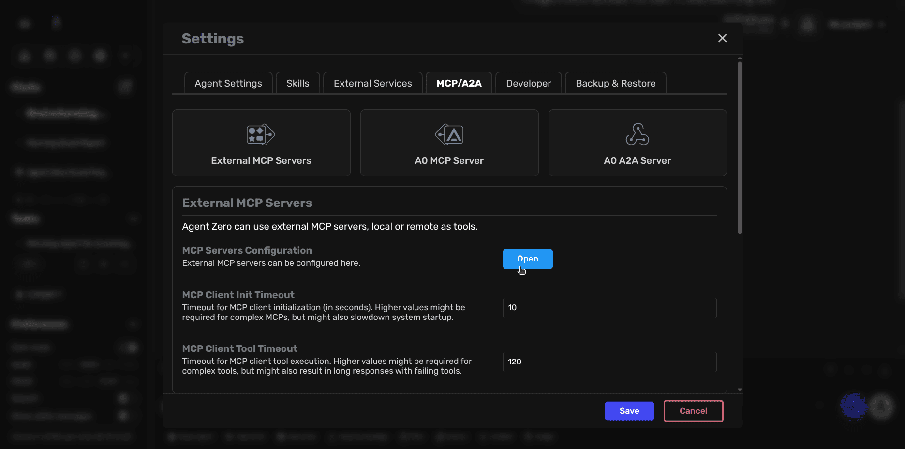
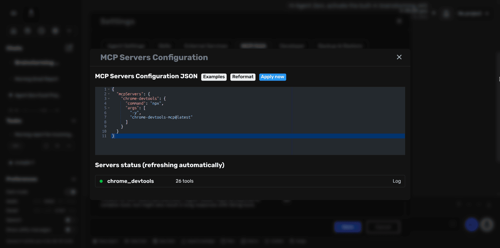

# MCP Server Setup

Agent Zero can connect to external MCP (Model Context Protocol) servers to extend its capabilities with additional tools. This guide shows you how to add MCP servers through the Settings UI.

## What are MCP Servers?

MCP servers are external tools that Agent Zero can use to perform specialized tasks. Popular examples include:

- **Browser automation** (Chrome DevTools, Playwright)
- **Workflow automation** (n8n)
- **Email operations** (Gmail)
- **Database access** (SQLite)

> [!NOTE]
> This guide covers connecting to external MCP servers as a client. For exposing Agent Zero as an MCP server, see the [advanced documentation](../developer/mcp-configuration.md).

## Adding an MCP Server

### Step 1: Open MCP Configuration

1. Click **Settings** in the sidebar
2. Navigate to the **MCP/A2A** tab
3. Click on **External MCP Servers**
4. Click the **Open** button to access the configuration editor



### Step 2: Add Your MCP Server

In the JSON editor, add your MCP server configuration. Here's a simple example:

```json
{
  "mcpServers": {
    "chrome-devtools": {
      "command": "npx",
      "args": ["-y", "chrome-devtools-mcp@latest"]
    }
  }
}
```



### Step 3: Apply and Verify

1. Click **Apply now** to save your configuration
2. The server status will appear below, showing:
   - Server name (e.g., `chrome_devtools`)
   - Number of available tools
   - Connection status (green indicator = connected)

> [!TIP]
> The first time you run an `npx`-based MCP server, it may take a few moments to download and initialize.

## Common MCP Server Examples

### Local Command-Based Server

```json
{
  "mcpServers": {
    "sqlite": {
      "command": "uvx",
      "args": ["mcp-server-sqlite", "--db-path", "/root/db.sqlite"]
    }
  }
}
```

### Remote HTTP Server

```json
{
  "mcpServers": {
    "external-api": {
      "url": "https://api.example.com/mcp",
      "headers": {
        "Authorization": "Bearer YOUR_API_KEY"
      }
    }
  }
}
```

## Docker Networking

If Agent Zero runs in Docker and your MCP server runs on the host:

- **macOS/Windows:** Use `host.docker.internal` in URLs
- **Linux:** Run the MCP server in the same Docker network and use the container name

## Using MCP Tools

Once connected, MCP tools become available to Agent Zero automatically. Tools are named with the server prefix, for example:

- Server name: `chrome-devtools`
- Tool becomes: `chrome_devtools.navigate_to_url`

Simply ask Agent Zero to perform tasks, and it will use the appropriate MCP tools when needed.

## Advanced Configuration

For detailed configuration options, server types, environment variables, and troubleshooting, see the [Advanced MCP Configuration Guide](../developer/mcp-configuration.md).

## Recommended MCP Servers

Community-tested and reliable MCP servers:

- **Chrome DevTools MCP** - Direct Chrome control
- **Playwright MCP** - Cross-browser automation
- **n8n MCP** - Workflow automation
- **Gmail MCP** - Email management
- **VSCode MCP** - IDE workflows

> [!TIP]
> For browser automation tasks, MCP-based browser tools are more reliable than the built-in browser agent.
