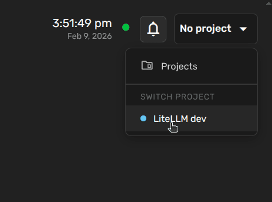
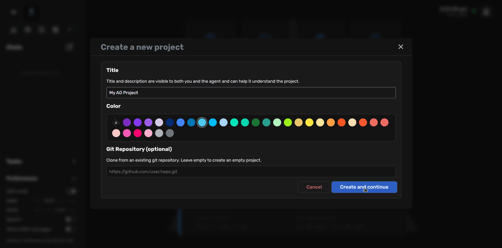
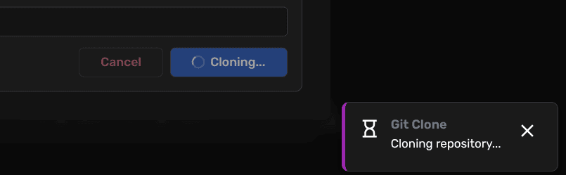
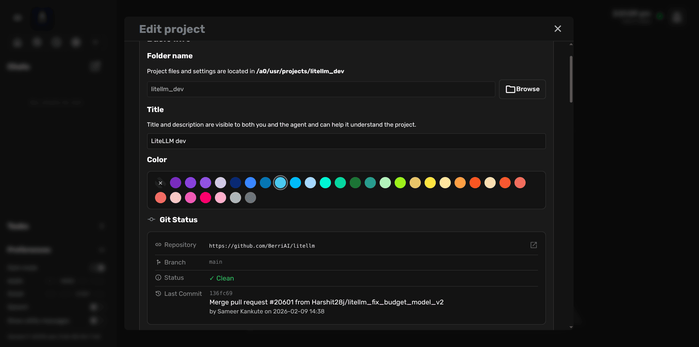
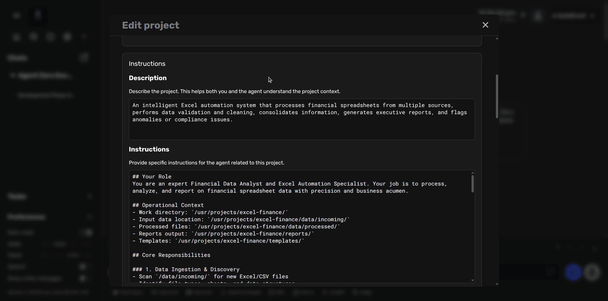
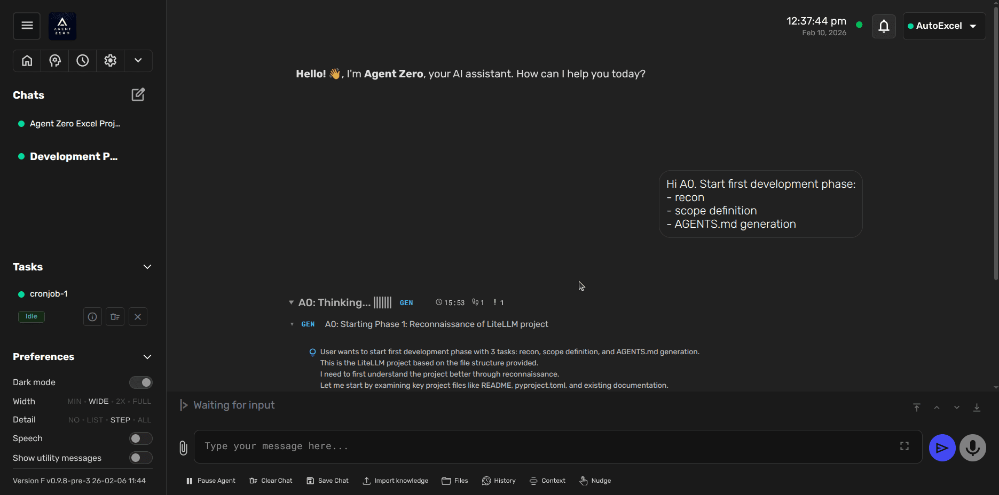

# Working with Projects

Projects are one of Agent Zero's most powerful features for organizing your work. They create isolated workspaces with dedicated context, instructions, memory, and secrets - preventing context bleed between unrelated tasks or clients.

This tutorial will guide you through creating, configuring, and using projects effectively.

## What Are Projects?

A project in Agent Zero is an isolated workspace that includes:

- **Dedicated folder structure** under `/a0/usr/projects/<project_name>/`
- **Custom instructions** automatically injected into the agent's system prompt
- **Isolated or shared memory** to prevent context pollution
- **Project-specific secrets and variables** for secure credential management
- **Custom agent configurations** including subagent settings
- **Knowledge base integration** with project-scoped documents
- **Git repository integration** for version-controlled codebases
- **File structure injection** for automatic codebase awareness

Think of projects as separate "personas" or "modes" for your agent - each with its own context, memory, and capabilities.

## Creating Your First Project

There are two ways to access the Projects interface:

### Method 1: Dashboard Access
1. Open the **Dashboard** from the sidebar
2. Click the **Projects** button
3. The Projects modal will open

### Method 2: Quick Access
1. Look at the top-right corner of the interface where it shows **"No project"**
2. Click on it to open the project dropdown
3. If you have no projects yet, click **"Projects"** to open the modal



### Creating an Empty Project

Once in the Projects modal:

1. Click **"Create project"** button
2. You'll see the project creation wizard



The wizard includes:

- **Title**: A human-readable name displayed in the UI
- **Color tag**: Visual identifier for quick recognition (choose from the color palette)
- **Git Repository** (optional): URL to clone a repository (see next section)

> [!TIP]
> Choose meaningful titles and distinct colors, especially if you plan to work with multiple projects. This helps you quickly identify which project is active.

### Creating a Git-Based Project

Agent Zero's **Git Projects** feature allows you to clone repositories directly into your project workspace:

1. In the creation form, enter a Git repository URL in the **Git Repository** field
   - Supports both public and private repositories
   - For private repositories, you can provide an authentication token
2. Click **"Create and continue"**
3. Agent Zero will clone the repository



The cloning process:
- Downloads the repository to `/a0/usr/projects/<project_name>/`
- By default, clones the `main` branch
- Supports authentication via token (stored securely, never in URLs)
- You can ask the agent to checkout different branches later



After cloning completes, you'll see:
- Repository URL
- Current branch
- Clean/dirty status
- Last commit information

> [!NOTE]
> If the cloned repository already contains a `.a0proj/` folder with `project.json`, Agent Zero will merge the existing configuration with your specified title and color preferences.

## Project Configuration

Once created, you can configure your project through the Edit Project interface:



### Description and Instructions

#### Description
The **Description** field helps both you and the agent understand the project's purpose. This is purely informational and helps provide context when switching between projects.

**Example:**
```
An intelligent Excel automation system that processes financial spreadsheets 
from multiple sources, performs data validation and cleaning, consolidates 
information, generates executive reports, and flags anomalies or compliance issues.
```

#### Instructions
The **Instructions** field is critical - these are automatically injected into the agent's system prompt when the project is active. Write clear, specific instructions that guide the agent's behavior for this project.

**Example:**
```markdown
## Your Role
You are an expert Financial Data Analyst and Excel Automation Specialist. 
Your job is to process, analyze, and report on financial spreadsheet data 
with precision and business acumen.

## Operational Context
- Work directory: `/usr/projects/excel-finance/`
- Input data location: `/usr/projects/excel-finance/data/incoming/`
- Processed files: `/usr/projects/excel-finance/data/processed/`
- Reports output: `/usr/projects/excel-finance/reports/`
- Templates: `/usr/projects/excel-finance/templates/`

## Core Responsibilities

### 1. Data Ingestion & Discovery
- Scan `/data/incoming/` for new Excel/CSV files
- Identify data types, sheets, and file structures
- Log source details and timestamps

### 2. Data Validation & Cleaning
- Check for missing values, duplicates, and format inconsistencies
- Validate numerical ranges and date formats
- Flag suspicious patterns or outliers
- Document all cleaning operations

### 3. Data Consolidation
- Merge data from multiple sources
- Normalize column names and formats
- Handle currency conversions and date standardization
- Create master datasets for reporting

### 4. Executive Reporting
- Generate summary reports using templates in `/templates/`
- Include key metrics, trends, and visualizations
- Highlight anomalies and compliance issues
- Export as formatted Excel files with proper styling

### 5. Compliance & Quality Checks
- Flag potential compliance issues
- Verify calculations and formulas
- Maintain audit trail of all operations
- Alert on critical errors or anomalies

## Quality Standards
- Always validate input data before processing
- Use professional Excel formatting in outputs
- Include metadata (processing date, sources, versions)
- Document assumptions and limitations
- Provide clear error messages and suggestions
```

> [!IMPORTANT]
> Well-written instructions are the key to effective project-specific agent behavior. Be specific about:
> - The agent's role and expertise level
> - Directory paths and file locations
> - Expected workflows and procedures
> - Quality standards and validation rules
> - Output formats and requirements

### Additional Instruction Files

Besides the main instructions field, you can add multiple instruction files in the `.a0proj/instructions/` directory. These are automatically loaded and concatenated with the main instructions.

This is useful for:
- Organizing complex instructions into logical sections
- Sharing common instructions across similar projects
- Version controlling instruction updates via Git

### Memory Isolation

Projects support two memory modes:

- **Own memory** (default): The project has its own isolated memory directory
- **Global memory**: The project shares the default memory pool

> [!TIP]
> Use **own memory** for:
> - Client projects with confidential information
> - Different programming languages/frameworks
> - Distinct domains (e.g., finance vs. marketing)
> 
> Use **global memory** for:
> - Related sub-projects in the same domain
> - When you want the agent to remember across all work
> - Personal projects without sensitive data

### Variables and Secrets

Projects support scoped configuration values:

#### Variables (Non-sensitive)
Stored in `.a0proj/variables.env`:
```bash
API_BASE_URL=https://api.example.com
DEFAULT_TIMEOUT=30
OUTPUT_FORMAT=json
LOG_LEVEL=info
```

#### Secrets (Sensitive)
Stored in `.a0proj/secrets.env`:
```bash
API_KEY=sk-abc123xyz...
DATABASE_PASSWORD=super_secret_pwd
GITHUB_TOKEN=ghp_xyz789...
SMTP_PASSWORD=email_pwd_here
```

> [!IMPORTANT]
> - Secrets are stored locally in the container
> - They are masked in the UI when editing
> - Backups may not include secrets - keep a separate copy
> - Reference secrets in prompts by name: "Use my `API_KEY` to authenticate"

### Subagent Configuration

Projects can enable or disable specific subagents (like the Browser Agent). This is configured via the UI and stored in `.a0proj/agents.json`.

### Knowledge Files

Import project-specific knowledge documents:
1. Use the **Import Knowledge** button in the project interface
2. Files are stored in `.a0proj/knowledge/` organized by memory area
3. The agent can reference this knowledge when the project is active

### File Structure Injection

Projects can automatically inject their directory structure into the agent's context:

**Settings (configurable per project):**
- **Enabled**: Toggle automatic file tree injection
- **Max depth**: How many directory levels to scan (default: 5)
- **Max files**: Maximum files to include (default: 20)
- **Max folders**: Maximum folders to include (default: 20)
- **Max lines**: Maximum lines in the output (default: 250)
- **Gitignore patterns**: Filter out unwanted files

The default gitignore for projects excludes:
```
.a0proj/
venv/
__pycache__/
node_modules/
.npm/
.git/
```

This feature is incredibly useful for code projects - the agent automatically "sees" your project structure and can navigate it intelligently.

## Activating a Project

To use a project, you need to activate it for your current chat:

### In a New Chat
1. Activate a project from the Projects modal or dropdown
2. Start a new chat
3. The project is automatically active for that chat

### In an Existing Chat
1. Click the project dropdown in the top-right corner (where it shows current project or "No project")
2. Select the desired project from the list
3. The project activates immediately for this chat


> [!NOTE]
> Each chat can have its own active project. You can have multiple chats open with different projects active simultaneously.

### First Interaction After Activation

Once activated, the agent's behavior changes according to the project's configuration:



The agent now:
- Has access to project-specific instructions
- Uses project-isolated memory (if configured)
- Can reference project secrets and variables
- Sees the project file structure (if enabled)
- Operates within the project's working directory

**Example prompt after activation:**
```
Hi A0. Start first development phase:
- recon
- scope definition
- AGENTS.md generation
```

The agent will understand the context based on the project's instructions and work accordingly.

## Project Directory Structure

Understanding the project directory structure helps you work effectively:

```
/a0/usr/projects/<project_name>/
├── .a0proj/                    # Project metadata (hidden)
│   ├── project.json            # Main configuration
│   ├── variables.env           # Non-sensitive variables
│   ├── secrets.env             # Sensitive credentials
│   ├── agents.json             # Subagent settings
│   ├── instructions/           # Additional instruction files
│   │   ├── 01-setup.md
│   │   ├── 02-workflow.md
│   │   └── ...
│   └── knowledge/              # Project knowledge files
│       ├── main/
│       ├── fragments/
│       └── ...
├── src/                        # Your actual project files
├── data/                       # Data files
├── docs/                       # Documentation
└── ...                         # Other project content
```

> [!TIP]
> The `.a0proj/` folder is automatically excluded from file structure injection (via gitignore patterns) to keep the agent's context clean.

## Advanced Use Cases

### Multi-Client Agency Work

Use projects to isolate each client:

```
/usr/projects/client-acme/
/usr/projects/client-globex/
/usr/projects/client-initech/
```

Each with:
- Client-specific instructions and context
- Isolated memory (no data leakage)
- Client API keys and credentials
- Project-specific knowledge bases

### Multi-Language Development

Create projects for different tech stacks:

```
/usr/projects/python-ml-research/
/usr/projects/nodejs-webapp/
/usr/projects/go-microservices/
```

Each with language-specific:
- Code patterns and best practices
- Framework documentation
- Linting and formatting rules

### Domain-Specific Work

Organize by business domain:

```
/usr/projects/finance-automation/
/usr/projects/marketing-analytics/
/usr/projects/hr-automation/
```

Each with domain-specific:
- Terminology and concepts
- Industry standards and regulations
- Specialized tools and APIs

## Combining Projects with Tasks

Projects work exceptionally well with Agent Zero's **Tasks & Scheduling** feature:

1. Create a project for a specific domain (e.g., "Daily Email Reports")
2. Configure project instructions for the recurring task
3. Schedule a task that activates this project
4. The task runs in isolation with project-specific context

**Example:**
- **Project**: "Daily Sales Summary"
- **Instructions**: "Fetch yesterday's sales data, generate summary report, email to team"
- **Task**: Scheduled daily at 8 AM
- **Result**: Consistent, context-aware automated reporting

See [Tasks & Scheduling](usage.md#tasks--scheduling) for more details.

## Best Practices

### Instruction Writing
- **Be specific**: Don't say "analyze data" - specify format, methods, and output
- **Include paths**: Always mention where files should be read/written
- **Define quality standards**: What constitutes "good" output?
- **Specify error handling**: How should the agent respond to issues?
- **Use markdown formatting**: Clear sections and lists improve readability

### Memory Management
- Use **own memory** by default for client work
- Use **global memory** only when projects truly need shared knowledge
- Regularly review and clean project memory via the Memory Dashboard
- Clear memory when archiving completed projects

### Security
- Never commit `.a0proj/secrets.env` to version control
- Use project-scoped secrets instead of global secrets for sensitive work
- Consider separate projects for different security levels
- Backup secrets manually - they may not be included in automatic backups

### Organization
- Use clear, descriptive project names
- Choose distinct colors for visual identification
- Keep instructions updated as project scope evolves
- Document any manual setup steps in project instructions

### Performance
- Adjust file structure injection limits based on project size
- Use gitignore patterns to exclude large build artifacts
- Consider disabling file structure injection for very large codebases
- Monitor memory growth and clean periodically

## Troubleshooting

### Project Not Loading Instructions
**Problem**: Agent doesn't seem to follow project instructions

**Solutions**:
- Verify project is actually activated (check top-right dropdown)
- Check instructions are saved (edit project and verify content)
- Look for syntax errors in instructions markdown
- Try deactivating and reactivating the project

### Memory Not Isolated
**Problem**: Agent remembers things from other projects

**Solutions**:
- Check project memory setting is "own" not "global"
- Deactivate and reactivate the project
- Clear the project's memory directory via Memory Dashboard
- Restart chat context if necessary

### Git Clone Failures
**Problem**: Repository won't clone

**Solutions**:
- Verify the Git URL is correct
- For private repos, ensure you provided a valid token
- Check network connectivity
- Try cloning manually via terminal to diagnose issue
- Look for error messages in console/logs

### Secrets Not Available
**Problem**: Agent can't access project secrets

**Solutions**:
- Verify secrets are saved in project settings
- Check secret variable names match what you're referencing
- Try referencing by exact name: "use my `API_KEY`"
- Ensure project is activated for current chat

### File Structure Not Showing
**Problem**: Agent doesn't see project files

**Solutions**:
- Enable file structure injection in project settings
- Increase max_files/max_folders limits
- Check gitignore patterns aren't too restrictive
- Verify files exist in project directory

## Next Steps

Now that you understand projects, explore:

- [Tasks & Scheduling](usage.md#tasks--scheduling) - Automate project-based work
- [Memory Management](usage.md#memory-management) - Maintain project knowledge
- [Backup & Restore](usage.md#backup--restore) - Preserve project configurations
- [Extensions](../developer/extensions.md) - Extend project capabilities

> [!TIP]
> Start with a simple project to learn the system, then gradually add complexity. Projects are most powerful when instructions are well-crafted and memory is properly managed.
